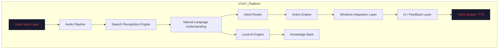

# VOXY Build Documentation — READ FIRST

| Field | Value |
|-------|-------|
| **Version** | 1.0.0 |
| **Status** | Production-Ready |
| **Last Updated** | 2026-07-17 |
| **Author** | VOXY Engineering Team |
| **Classification** | Internal — Engineering Foundation |

---

## Purpose

This document is the entry point for the entire VOXY Build Documentation repository. It establishes context, orientation, and the reading order required to understand, maintain, and extend the VOXY platform.

**VOXY** is a mission-critical, enterprise-grade, voice-first AI assistant built for the Windows platform. It operates offline-first, local-AI-first, with sub-200ms latency targets for voice interaction.

---

## Audience

| Role | Primary Documents |
|------|-----------------|
| **Principal Engineers** | 01, 02, 03, 05, 39, 40 |
| **Software Engineers** | 04, 06, 08, 09, 36, 37, 38 |
| **AI Coding Agents** | 07, 08, 09, 25, 26, 29, 30 |
| **Technical Writers** | 27, 31, 32, 33 |
| **DevOps / Release Engineers** | 02, 34, 35, 40 |
| **New Team Members** | 00, 01, 10–23, 24, 33 |
| **Architecture Review Board** | 28, 29, 30, 39 |

---

## Reading Order

1. **00_READ_FIRST.md** (this document) — Orientation and navigation.
2. **01_PROJECT_STRUCTURE.md** — High-level system architecture and module map.
3. **02_BUILD_ORDER.md** — Sequential build phases with dependencies.
4. **03_TECH_STACK.md** — Technology selections with rationale.
5. **04_CODING_STANDARDS.md** — Language-specific conventions and patterns.
6. **05_ENGINEERING_RULES.md** — Non-negotiable engineering constraints.
7. **06_DEVELOPER_WORKFLOW.md** — Git workflow, branching, CI/CD.
8. **07_AI_AGENT_PLAYBOOK.md** — Instructions for AI coding agents.
9. **08_MODULE_TEMPLATE.md** — Standard template for new modules.
10. **09_IMPLEMENTATION_CHECKLISTS.md** — Per-module build checklists.
11. **10_GLOSSARY_A.md** through **23_GLOSSARY_N.md** — Engineering glossary (A–N).
12. **24_ABBREVIATIONS.md** — Canonical abbreviation registry.
13. **25_CANONICAL_TERMINOLOGY.md** — Terminology standardization.
14. **26_NAMING_CONVENTIONS.md** — Naming rules across all artifacts.
15. **27_DOCUMENTATION_STYLE_GUIDE.md** — How to write VOXY documentation.
16. **28_DECISION_LOG_TEMPLATE.md** — Decision record template.
17. **29_ADR_TEMPLATE.md** — Architecture Decision Record template.
18. **30_RFC_TEMPLATE.md** — Request for Comments template.
19. **31_BUILD_LOG_TEMPLATE.md** — Build log entry template.
20. **32_CHANGELOG_GUIDE.md** — Changelog format and rules.
21. **33_CONTRIBUTING_GUIDE.md** — Contribution guidelines.
22. **34_REPOSITORY_RULES.md** — Repository governance.
23. **35_FOLDER_CONVENTIONS.md** — Directory structure conventions.
24. **36_DEPENDENCY_GUIDE.md** — Dependency management rules.
25. **37_WINDOWS_API_GUIDE.md** — Windows API integration patterns.
26. **38_LIBRARY_GUIDE.md** — Third-party library usage guide.
27. **39_ENGINEERING_CHECKLIST.md** — Pre-release engineering verification.
28. **40_RELEASE_CHECKLIST.md** — Release readiness verification.

---

## Engineering Notes

- **No placeholders.** Every document is complete and production-ready.
- **No TODO sections.** All sections contain actionable, authoritative content.
- **Cross-referenced.** Internal links connect related documents.
- **Versioned.** Each document carries a version header for change tracking.
- **Mermaid diagrams.** Visual architecture where diagrams aid comprehension.
- **Checklist-driven.** Every major process includes verification checklists.

---

## System Context

---

## Core Principles

| Principle | Description | Enforcement |
|-----------|-------------|-------------|
| **Windows First** | All features target Windows 10/11 natively. | CI gates on Windows runners only. |
| **Offline First** | Core functionality works without internet. | Network-disabled integration tests. |
| **Voice First** | Voice is the primary input modality. | All commands must have voice equivalents. |
| **Local AI First** | Inference runs on-device before cloud fallback. | ONNX Runtime / DirectML default backends. |
| **Low Latency** | <200ms end-to-end for voice commands. | Performance benchmarks in CI. |
| **Enterprise Grade** | Audit logging, RBAC, encryption at rest. | Security scan gates in CI/CD. |

---

## References

- [Microsoft Windows App SDK Documentation](https://learn.microsoft.com/en-us/windows/apps/windows-app-sdk/)
- [WinRT API Reference](https://learn.microsoft.com/en-us/uwp/api/)
- [ONNX Runtime Documentation](https://onnxruntime.ai/docs/)
- [Windows UI Automation](https://learn.microsoft.com/en-us/windows/win32/winauto/entry-uiauto-win32)
- [Semantic Kernel](https://learn.microsoft.com/en-us/semantic-kernel/)
- [OpenAI Agents SDK](https://platform.openai.com/docs/guides/agents)
- [Anthropic Engineering Blog](https://www.anthropic.com/engineering)

---

## Cross References

- See [01_PROJECT_STRUCTURE.md](01_PROJECT_STRUCTURE.md) for system architecture.
- See [03_TECH_STACK.md](03_TECH_STACK.md) for technology selections.
- See [05_ENGINEERING_RULES.md](05_ENGINEERING_RULES.md) for non-negotiable constraints.
- See [07_AI_AGENT_PLAYBOOK.md](07_AI_AGENT_PLAYBOOK.md) for AI agent instructions.
- See [10_GLOSSARY_A.md](10_GLOSSARY_A.md) through [23_GLOSSARY_N.md](23_GLOSSARY_N.md) for terminology.

---

## Best Practices

1. **Read this document first** before any other document in the repository.
2. **Follow the reading order** — documents build on each other.
3. **Use the glossary** when encountering unfamiliar terms.
4. **Check cross-references** for deeper context on any topic.
5. **Verify with checklists** before marking any task complete.

---

## Common Mistakes

| Mistake | Consequence | Prevention |
|---------|-------------|------------|
| Skipping 00_READ_FIRST.md | Lost context, incorrect assumptions | Mandatory onboarding checklist |
| Reading documents out of order | Missing prerequisite knowledge | Follow the numbered sequence |
| Ignoring glossary terms | Inconsistent terminology usage | Cross-reference glossary before writing code |
| Overlooking cross-references | Incomplete understanding | Follow all linked references |

---

## Review Checklist

- [ ] All team members have read this document.
- [ ] Reading order is understood and followed.
- [ ] Core principles are memorized and applied.
- [ ] Cross-references are bookmarked for quick access.
- [ ] Audience mapping is used to route questions to correct documents.

---

*End of 00_READ_FIRST.md*
