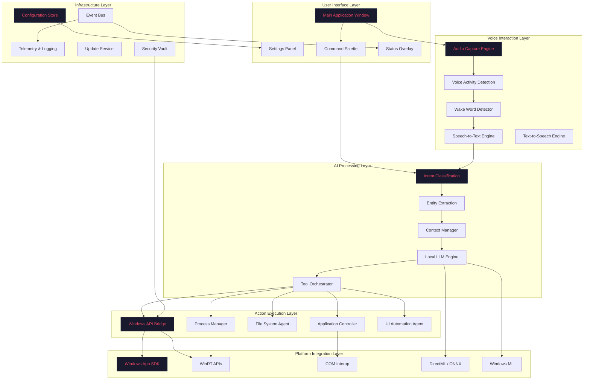
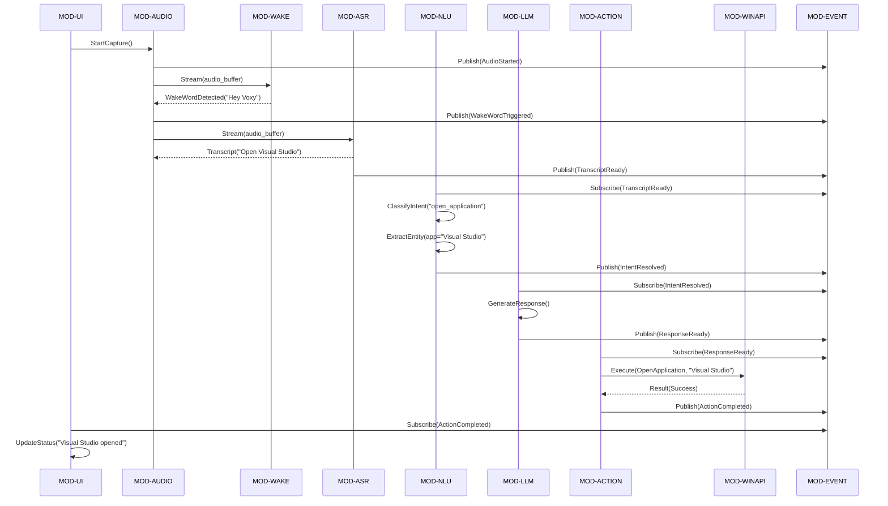
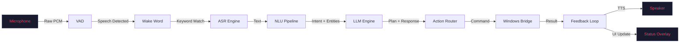
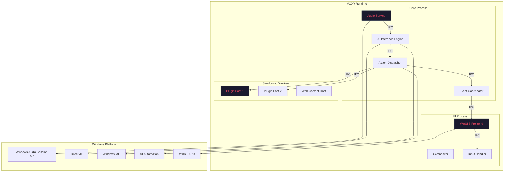
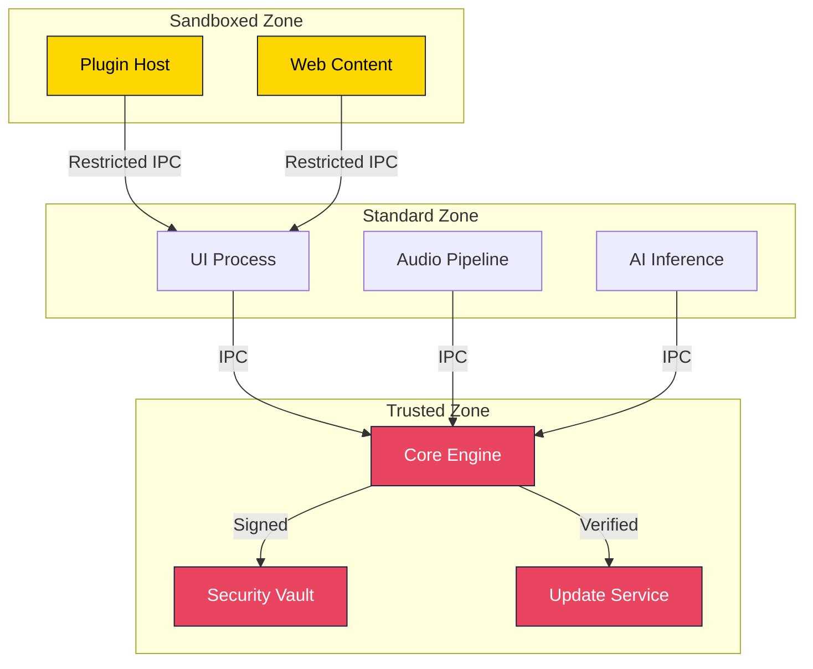

# VOXY — Project Structure

| Field | Value |
|-------|-------|
| **Version** | 1.0.0 |
| **Status** | Production-Ready |
| **Last Updated** | 2026-07-17 |
| **Author** | VOXY Engineering Team |
| **Classification** | Internal — Architecture Foundation |

---

## Purpose

This document defines the complete system architecture, module decomposition, and directory layout for the VOXY platform. It serves as the authoritative reference for all engineers and AI coding agents working on the project.

---

## Scope

Covers:
- High-level system architecture
- Module decomposition and responsibilities
- Directory structure conventions
- Inter-module communication patterns
- Data flow diagrams
- Deployment topology

Does not cover:
- Implementation details (see per-module documentation)
- Technology selections (see [03_TECH_STACK.md](03_TECH_STACK.md))
- Coding standards (see [04_CODING_STANDARDS.md](04_CODING_STANDARDS.md))

---

## Audience

- Principal Engineers and Architects
- Tech Leads establishing new modules
- AI Coding Agents generating module scaffolding
- DevOps Engineers configuring CI/CD pipelines

---

## System Architecture

### High-Level Component Diagram



---

## Module Decomposition

### Module Registry

| Module ID | Name | Responsibility | Language | Criticality |
|-----------|------|----------------|----------|-------------|
| `MOD-AUDIO` | Audio Pipeline | Capture, playback, VAD, preprocessing | Rust | Critical |
| `MOD-WAKE` | Wake Word Engine | Keyword spotting, always-on listening | Rust | Critical |
| `MOD-ASR` | Speech Recognition | STT transcription, language detection | Rust/C++ | Critical |
| `MOD-NLU` | Natural Language Understanding | Intent classification, entity extraction | Rust/Python | Critical |
| `MOD-LLM` | Local LLM Engine | On-device inference, context management | Rust/C++ | Critical |
| `MOD-TTS` | Text-to-Speech | Voice synthesis, prosody control | Rust/C++ | High |
| `MOD-ACTION` | Action Engine | Command routing, execution orchestration | Rust | Critical |
| `MOD-WINAPI` | Windows API Bridge | Win32/WinRT interop, COM wrappers | Rust/C++ | Critical |
| `MOD-UIAUTO` | UI Automation | Accessibility tree, control interaction | Rust/C++ | High |
| `MOD-APPCTL` | Application Controller | App launch, window management | Rust | High |
| `MOD-FILE` | File System Agent | File operations, path resolution | Rust | High |
| `MOD-PROC` | Process Manager | Process lifecycle, monitoring | Rust | Medium |
| `MOD-CONFIG` | Configuration Store | Settings persistence, schema validation | Rust | High |
| `MOD-EVENT` | Event Bus | Pub/sub messaging, event routing | Rust | Critical |
| `MOD-TELEM` | Telemetry & Logging | Metrics, traces, audit logs | Rust | High |
| `MOD-UPDATE` | Update Service | OTA updates, rollback, signatures | Rust | Medium |
| `MOD-SEC` | Security Vault | Credential storage, encryption | Rust | Critical |
| `MOD-UI` | User Interface | WinUI 3 frontend, XAML markup | C#/XAML | High |
| `MOD-KB` | Knowledge Base | Vector store, document retrieval | Rust | Medium |
| `MOD-PLUG` | Plugin System | Extension loading, sandboxing | Rust | Medium |

---

## Directory Structure

```
voxy/
├── .github/
│   ├── workflows/
│   │   ├── ci.yml
│   │   ├── release.yml
│   │   └── security-scan.yml
│   ├── ISSUE_TEMPLATE/
│   └── PULL_REQUEST_TEMPLATE.md
│
├── docs/
│   ├── architecture/
│   ├── api/
│   ├── guides/
│   └── reference/
│
├── src/
│   ├── audio/                    # MOD-AUDIO
│   │   ├── capture/
│   │   ├── playback/
│   │   ├── vad/
│   │   ├── preprocessing/
│   │   ├── resampling/
│   │   ├── tests/
│   │   ├── Cargo.toml
│   │   └── README.md
│   │
│   ├── wake_word/                # MOD-WAKE
│   │   ├── detector/
│   │   ├── models/
│   │   ├── training/
│   │   ├── tests/
│   │   ├── Cargo.toml
│   │   └── README.md
│   │
│   ├── asr/                      # MOD-ASR
│   │   ├── engine/
│   │   ├── models/
│   │   ├── language/
│   │   ├── streaming/
│   │   ├── tests/
│   │   ├── Cargo.toml
│   │   └── README.md
│   │
│   ├── nlu/                      # MOD-NLU
│   │   ├── intent/
│   │   ├── entity/
│   │   ├── context/
│   │   ├── models/
│   │   ├── tests/
│   │   ├── Cargo.toml
│   │   └── README.md
│   │
│   ├── llm/                      # MOD-LLM
│   │   ├── inference/
│   │   ├── context/
│   │   ├── models/
│   │   ├── tokenization/
│   │   ├── quantization/
│   │   ├── tests/
│   │   ├── Cargo.toml
│   │   └── README.md
│   │
│   ├── tts/                      # MOD-TTS
│   │   ├── synthesis/
│   │   ├── voices/
│   │   ├── prosody/
│   │   ├── tests/
│   │   ├── Cargo.toml
│   │   └── README.md
│   │
│   ├── action/                   # MOD-ACTION
│   │   ├── router/
│   │   ├── executor/
│   │   ├── registry/
│   │   ├── tests/
│   │   ├── Cargo.toml
│   │   └── README.md
│   │
│   ├── winapi_bridge/            # MOD-WINAPI
│   │   ├── com/
│   │   ├── winrt/
│   │   ├── win32/
│   │   ├── uwp/
│   │   ├── tests/
│   │   ├── Cargo.toml
│   │   └── README.md
│   │
│   ├── ui_automation/            # MOD-UIAUTO
│   │   ├── tree/
│   │   ├── controls/
│   │   ├── patterns/
│   │   ├── tests/
│   │   ├── Cargo.toml
│   │   └── README.md
│   │
│   ├── app_control/              # MOD-APPCTL
│   │   ├── launcher/
│   │   ├── window/
│   │   ├── focus/
│   │   ├── tests/
│   │   ├── Cargo.toml
│   │   └── README.md
│   │
│   ├── file_system/              # MOD-FILE
│   │   ├── operations/
│   │   ├── search/
│   │   ├── path/
│   │   ├── tests/
│   │   ├── Cargo.toml
│   │   └── README.md
│   │
│   ├── process/                  # MOD-PROC
│   │   ├── lifecycle/
│   │   ├── monitor/
│   │   ├── tests/
│   │   ├── Cargo.toml
│   │   └── README.md
│   │
│   ├── config/                   # MOD-CONFIG
│   │   ├── store/
│   │   ├── schema/
│   │   ├── migration/
│   │   ├── tests/
│   │   ├── Cargo.toml
│   │   └── README.md
│   │
│   ├── event_bus/                # MOD-EVENT
│   │   ├── core/
│   │   ├── channels/
│   │   ├── handlers/
│   │   ├── tests/
│   │   ├── Cargo.toml
│   │   └── README.md
│   │
│   ├── telemetry/                # MOD-TELEM
│   │   ├── logging/
│   │   ├── metrics/
│   │   ├── tracing/
│   │   ├── audit/
│   │   ├── tests/
│   │   ├── Cargo.toml
│   │   └── README.md
│   │
│   ├── update/                   # MOD-UPDATE
│   │   ├── downloader/
│   │   ├── verifier/
│   │   ├── installer/
│   │   ├── rollback/
│   │   ├── tests/
│   │   ├── Cargo.toml
│   │   └── README.md
│   │
│   ├── security/                 # MOD-SEC
│   │   ├── vault/
│   │   ├── crypto/
│   │   ├── auth/
│   │   ├── tests/
│   │   ├── Cargo.toml
│   │   └── README.md
│   │
│   ├── ui/                       # MOD-UI
│   │   ├── App.xaml
│   │   ├── MainWindow.xaml
│   │   ├── Pages/
│   │   ├── Controls/
│   │   ├── Themes/
│   │   ├── ViewModels/
│   │   ├── Services/
│   │   ├── Assets/
│   │   ├── voxy.csproj
│   │   └── README.md
│   │
│   ├── knowledge_base/           # MOD-KB
│   │   ├── vector_store/
│   │   ├── indexing/
│   │   ├── retrieval/
│   │   ├── tests/
│   │   ├── Cargo.toml
│   │   └── README.md
│   │
│   └── plugin/                   # MOD-PLUG
│       ├── loader/
│       ├── sandbox/
│       ├── api/
│       ├── tests/
│       ├── Cargo.toml
│       └── README.md
│
├── models/                       # Pre-trained model artifacts
│   ├── wake_word/
│   ├── asr/
│   ├── nlu/
│   ├── llm/
│   ├── tts/
│   └── README.md
│
├── assets/                       # Static resources
│   ├── icons/
│   ├── sounds/
│   ├── themes/
│   └── fonts/
│
├── scripts/                      # Build and deployment scripts
│   ├── build/
│   ├── deploy/
│   ├── test/
│   └── setup/
│
├── tests/                        # Integration and E2E tests
│   ├── integration/
│   ├── e2e/
│   ├── fixtures/
│   └── README.md
│
├── tools/                        # Development utilities
│   ├── benchmark/
│   ├── profiler/
│   └── generator/
│
├── build-docs/                   # This documentation repository
│
├── Cargo.toml                    # Workspace root
├── Cargo.lock
├── voxy.sln
├── LICENSE
├── CHANGELOG.md
└── README.md
```

---

## Inter-Module Communication

### Communication Patterns



### Communication Protocol

| Pattern | Use Case | Implementation |
|---------|----------|----------------|
| **Event Bus** | Async notifications, decoupled updates | Tokio broadcast channels |
| **Request/Response** | Synchronous operations | gRPC over local IPC |
| **Streaming** | Audio data, model outputs | Ring buffers + channels |
| **Shared Memory** | Large model weights, audio buffers | `memmap2` + atomic refs |

---

## Data Flow

### Voice Command Pipeline



---

## Deployment Topology

### Runtime Architecture



---

## Engineering Notes

### Critical Path

The critical path for voice command latency is:

1. **Audio Capture** → 5-10ms (WASAPI event-driven mode)
2. **VAD** → 10-20ms (frame-based detection)
3. **Wake Word** → 50-100ms (ONNX Runtime inference)
4. **ASR** → 100-200ms (streaming Whisper/Parakeet)
5. **NLU** → 20-50ms (intent classification)
6. **Action Execution** → 50-200ms (Windows API calls)
7. **TTS Response** → 100-300ms (optional feedback)

**Target E2E latency: <200ms for simple commands, <500ms for complex queries.**

### Fault Tolerance

| Failure Mode | Mitigation | Module |
|--------------|------------|--------|
| Audio device disconnected | Fallback to default device + user notification | MOD-AUDIO |
| Model load failure | Fallback to smaller model + cloud option | MOD-LLM |
| Windows API error | Retry with exponential backoff + logging | MOD-WINAPI |
| Plugin crash | Isolate worker process + restart | MOD-PLUG |
| Memory pressure | Unload non-critical models + GC | MOD-LLM |

### Security Boundaries



---

## References

- [Windows App SDK Architecture](https://learn.microsoft.com/en-us/windows/apps/windows-app-sdk/)
- [WinRT Component Architecture](https://learn.microsoft.com/en-us/uwp/winrt-components/)
- [ONNX Runtime Architecture](https://onnxruntime.ai/docs/reference/high-level-design.html)
- [Windows UI Automation Overview](https://learn.microsoft.com/en-us/windows/win32/winauto/entry-uiauto-win32)

---

## Cross References

- See [02_BUILD_ORDER.md](02_BUILD_ORDER.md) for build sequence.
- See [03_TECH_STACK.md](03_TECH_STACK.md) for technology selections.
- See [08_MODULE_TEMPLATE.md](08_MODULE_TEMPLATE.md) for module scaffolding.
- See [37_WINDOWS_API_GUIDE.md](37_WINDOWS_API_GUIDE.md) for Windows API patterns.

---

## Best Practices

1. **Single Responsibility:** Each module has exactly one primary responsibility.
2. **Dependency Direction:** Dependencies flow inward (outer layers depend on inner abstractions).
3. **Interface Segregation:** Modules communicate through well-defined traits/interfaces.
4. **Fail Fast:** Validate inputs at module boundaries.
5. **Observability:** Every module emits structured events for telemetry.

---

## Common Mistakes

| Mistake | Consequence | Prevention |
|---------|-------------|------------|
| Circular dependencies | Build failures, tight coupling | Use dependency injection + trait bounds |
| Bypassing event bus | Tight coupling, testability issues | Enforce event-driven communication |
| Direct Win32 calls from UI | Threading issues, crashes | Route through MOD-WINAPI |
| Loading models in UI thread | UI freezes | Offload to background threads |
| Hardcoded paths | Portability issues | Use MOD-CONFIG for all paths |

---

## Review Checklist

- [ ] All 20 modules are documented with clear responsibilities.
- [ ] Directory structure follows [35_FOLDER_CONVENTIONS.md](35_FOLDER_CONVENTIONS.md).
- [ ] Communication patterns are consistent across modules.
- [ ] Critical path latency targets are documented.
- [ ] Security boundaries are enforced in code.
- [ ] Fault tolerance strategies are implemented per module.
- [ ] Cross-references to related documents are verified.

---

*End of 01_PROJECT_STRUCTURE.md*
