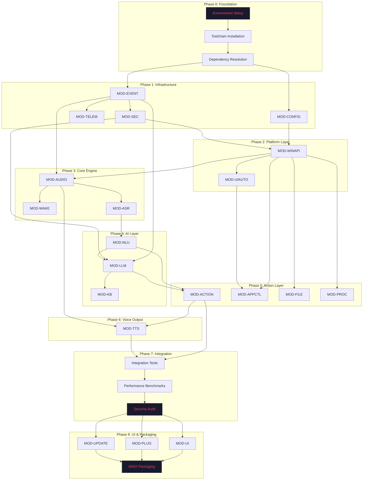
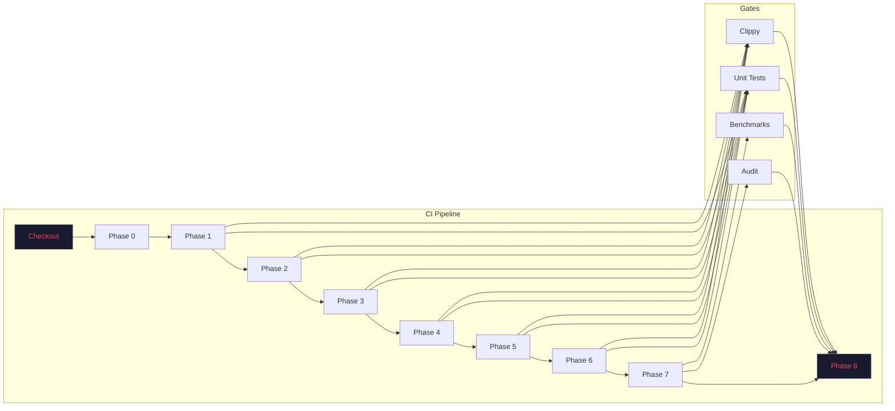

# VOXY — Build Order

| Field | Value |
|-------|-------|
| **Version** | 1.0.0 |
| **Status** | Production-Ready |
| **Last Updated** | 2026-07-17 |
| **Author** | VOXY Engineering Team |
| **Classification** | Internal — Build Foundation |

---

## Purpose

This document defines the exact sequential order for building the VOXY platform from source. It specifies dependencies between modules, build phases, verification gates, and environment requirements.

---

## Scope

Covers:
- Build phase sequence and dependencies
- Per-phase module assignments
- Environment prerequisites
- Verification gates between phases
- Parallelization opportunities
- CI/CD pipeline mapping

Does not cover:
- Detailed build commands (see per-module README)
- Technology rationale (see [03_TECH_STACK.md](03_TECH_STACK.md))
- Release procedures (see [40_RELEASE_CHECKLIST.md](40_RELEASE_CHECKLIST.md))

---

## Audience

- Build Engineers and DevOps
- CI/CD Pipeline Authors
- New Team Members setting up the project
- AI Coding Agents generating build scripts

---

## Build Dependency Graph



---

## Build Phases

### Phase 0: Environment Setup

**Objective:** Prepare the development environment with all required toolchains and dependencies.

| Step | Action | Verification |
|------|--------|--------------|
| 0.1 | Install Rust toolchain (stable + nightly for cargo-fuzz) | rustc --version >= 1.85.0 |
| 0.2 | Install Visual Studio 2022 with C++ workload | cl.exe available in PATH |
| 0.3 | Install Windows SDK (10.0.26100.0 or later) | Windows.h in include path |
| 0.4 | Install Windows App SDK 2.0+ | Microsoft.WindowsAppSDK NuGet |
| 0.5 | Install Python 3.12+ (for model conversion scripts) | python --version |
| 0.6 | Install ONNX Runtime 1.19+ with DirectML | onnxruntime.dll in PATH |
| 0.7 | Install Git LFS (for model binaries) | git lfs version |
| 0.8 | Clone repository with submodules | git submodule update --init --recursive |
| 0.9 | Install cargo tools: cargo-nextest, cargo-deny, cargo-audit | cargo nextest --version |
| 0.10 | Configure environment variables (see .env.example) | scripts\setup\verify-env.ps1 |

**Estimated Duration:** 45-60 minutes (first time)
**Parallelizable:** No — sequential setup

---

### Phase 1: Infrastructure Modules

**Objective:** Build the foundational modules that all other modules depend on.

#### 1.1 MOD-EVENT (Event Bus)

```bash
cd src/event_bus
cargo build --release
cargo test
cargo clippy -- -D warnings
cargo doc --no-deps
```

**Dependencies:** None (foundation module)
**Verification:** All unit tests pass, zero clippy warnings

#### 1.2 MOD-CONFIG (Configuration Store)

```bash
cd src/config
cargo build --release
cargo test
cargo clippy -- -D warnings
```

**Dependencies:** MOD-EVENT
**Verification:** Schema validation tests pass, migration tests pass

#### 1.3 MOD-TELEM (Telemetry & Logging)

```bash
cd src/telemetry
cargo build --release
cargo test
cargo clippy -- -D warnings
```

**Dependencies:** MOD-EVENT, MOD-CONFIG
**Verification:** Structured logging tests, metrics emission tests

#### 1.4 MOD-SEC (Security Vault)

```bash
cd src/security
cargo build --release
cargo test
cargo clippy -- -D warnings
```

**Dependencies:** MOD-CONFIG
**Verification:** Encryption/decryption round-trip, key derivation tests

**Phase 1 Estimated Duration:** 15-20 minutes
**Parallelizable:** MOD-EVENT and MOD-CONFIG can build in parallel; MOD-TELEM and MOD-SEC depend on their completion.

---

### Phase 2: Platform Layer

**Objective:** Build Windows platform integration modules.

#### 2.1 MOD-WINAPI (Windows API Bridge)

```bash
cd src/winapi_bridge
cargo build --release
cargo test
cargo clippy -- -D warnings
```

**Dependencies:** MOD-EVENT, MOD-CONFIG, MOD-SEC
**Verification:** COM interop tests, WinRT binding tests, Win32 API tests

#### 2.2 MOD-UIAUTO (UI Automation)

```bash
cd src/ui_automation
cargo build --release
cargo test
cargo clippy -- -D warnings
```

**Dependencies:** MOD-WINAPI, MOD-EVENT
**Verification:** Accessibility tree traversal tests, control pattern tests

**Phase 2 Estimated Duration:** 20-25 minutes
**Parallelizable:** MOD-WINAPI and MOD-UIAUTO can build sequentially (UIAUTO depends on WINAPI).

---

### Phase 3: Core Engine

**Objective:** Build audio capture, wake word, and speech recognition modules.

#### 3.1 MOD-AUDIO (Audio Pipeline)

```bash
cd src/audio
cargo build --release
cargo test
cargo clippy -- -D warnings
```

**Dependencies:** MOD-EVENT, MOD-WINAPI
**Verification:** WASAPI capture/playback tests, VAD accuracy tests, resampling tests

#### 3.2 MOD-WAKE (Wake Word Engine)

```bash
cd src/wake_word
cargo build --release
# Download pre-trained model if not present
scripts\models\download-wake-model.ps1
cargo test
cargo clippy -- -D warnings
```

**Dependencies:** MOD-AUDIO, MOD-EVENT
**Verification:** Wake word detection accuracy >95%, false positive rate <1%

#### 3.3 MOD-ASR (Speech Recognition)

```bash
cd src/asr
cargo build --release
# Download ONNX models
scripts\models\download-asr-models.ps1
cargo test --release
# Run accuracy benchmarks
scripts\benchmark\asr-benchmark.ps1
cargo clippy -- -D warnings
```

**Dependencies:** MOD-AUDIO, MOD-EVENT, MOD-CONFIG
**Verification:** WER <15% on LibriSpeech test-clean, latency <200ms

**Phase 3 Estimated Duration:** 30-45 minutes (includes model downloads)
**Parallelizable:** MOD-AUDIO can build independently; MOD-WAKE and MOD-ASR depend on MOD-AUDIO.

---

### Phase 4: AI Layer

**Objective:** Build natural language understanding, local LLM inference, and knowledge base.

#### 4.1 MOD-NLU (Natural Language Understanding)

```bash
cd src/nlu
cargo build --release
# Download intent classification model
scripts\models\download-nlu-models.ps1
cargo test
cargo clippy -- -D warnings
```

**Dependencies:** MOD-EVENT, MOD-ASR
**Verification:** Intent accuracy >90%, entity F1 >85%

#### 4.2 MOD-LLM (Local LLM Engine)

```bash
cd src/llm
cargo build --release
# Download quantized models
scripts\models\download-llm-models.ps1
cargo test --release
# Run inference benchmarks
scripts\benchmark\llm-benchmark.ps1
cargo clippy -- -D warnings
```

**Dependencies:** MOD-EVENT, MOD-CONFIG, MOD-SEC
**Verification:** Token generation >20 tok/s on target hardware, memory usage <8GB

#### 4.3 MOD-KB (Knowledge Base)

```bash
cd src/knowledge_base
cargo build --release
cargo test
cargo clippy -- -D warnings
```

**Dependencies:** MOD-EVENT, MOD-CONFIG
**Verification:** Vector search accuracy, indexing performance

**Phase 4 Estimated Duration:** 45-60 minutes (includes large model downloads)
**Parallelizable:** MOD-NLU and MOD-KB can build in parallel; MOD-LLM is independent after Phase 1.

---

### Phase 5: Action Layer

**Objective:** Build command execution, application control, and system integration.

#### 5.1 MOD-ACTION (Action Engine)

```bash
cd src/action
cargo build --release
cargo test
cargo clippy -- -D warnings
```

**Dependencies:** MOD-EVENT, MOD-NLU, MOD-LLM
**Verification:** Command routing tests, execution timeout tests, error handling tests

#### 5.2 MOD-APPCTL (Application Controller)

```bash
cd src/app_control
cargo build --release
cargo test
cargo clippy -- -D warnings
```

**Dependencies:** MOD-WINAPI, MOD-EVENT
**Verification:** App launch tests, window focus tests, process enumeration tests

#### 5.3 MOD-FILE (File System Agent)

```bash
cd src/file_system
cargo build --release
cargo test
cargo clippy -- -D warnings
```

**Dependencies:** MOD-WINAPI, MOD-EVENT
**Verification:** File operation tests, path resolution tests, permission tests

#### 5.4 MOD-PROC (Process Manager)

```bash
cd src/process
cargo build --release
cargo test
cargo clippy -- -D warnings
```

**Dependencies:** MOD-WINAPI, MOD-EVENT
**Verification:** Process lifecycle tests, monitoring tests, resource limit tests

**Phase 5 Estimated Duration:** 20-25 minutes
**Parallelizable:** All four modules can build in parallel after their dependencies are ready.

---

### Phase 6: Voice Output

**Objective:** Build text-to-speech synthesis.

#### 6.1 MOD-TTS (Text-to-Speech)

```bash
cd src/tts
cargo build --release
# Download voice models
scripts\models\download-tts-models.ps1
cargo test --release
# Run quality benchmarks
scripts\benchmark\tts-benchmark.ps1
cargo clippy -- -D warnings
```

**Dependencies:** MOD-AUDIO, MOD-ACTION
**Verification:** MOS score >3.5, latency <300ms for short phrases

**Phase 6 Estimated Duration:** 20-30 minutes
**Parallelizable:** No — single module, depends on Phase 3 and Phase 5.

---

### Phase 7: Integration

**Objective:** Run integration tests, performance benchmarks, and security audits.

#### 7.1 Integration Tests

```bash
# Run all integration tests
cargo test --workspace --test integration
# Run E2E voice command tests
scripts\test\e2e-voice-tests.ps1
```

**Verification:** All integration tests pass, E2E voice command success rate >95%

#### 7.2 Performance Benchmarks

```bash
# Run full benchmark suite
scripts\benchmark\full-benchmark.ps1
```

**Verification:**
| Metric | Target | Acceptance |
|--------|--------|------------|
| Wake Word Latency | <100ms | <150ms |
| ASR Latency | <200ms | <300ms |
| NLU Latency | <50ms | <100ms |
| LLM Token Rate | >20 tok/s | >10 tok/s |
| Action Execution | <200ms | <500ms |
| TTS Latency | <300ms | <500ms |
| E2E Simple Command | <500ms | <1000ms |
| E2E Complex Query | <2000ms | <5000ms |

#### 7.3 Security Audit

```bash
# Dependency vulnerability scan
cargo audit
# License compliance check
cargo deny check
# Static analysis
cargo clippy --workspace -- -D warnings
# Fuzzing (if available)
cargo fuzz run audio_fuzz --max_total_time=300
cargo fuzz run asr_fuzz --max_total_time=300
```

**Verification:** Zero critical/high vulnerabilities, all licenses compliant, zero clippy warnings

**Phase 7 Estimated Duration:** 30-45 minutes
**Parallelizable:** Benchmarks and security audit can run in parallel.

---

### Phase 8: UI & Packaging

**Objective:** Build the WinUI 3 frontend, plugin system, update service, and create the MSIX package.

#### 8.1 MOD-UI (User Interface)

```bash
cd src/ui
# Restore NuGet packages
nuget restore voxy.sln
# Build WinUI 3 project
msbuild voxy.csproj /p:Configuration=Release /p:Platform=x64
# Run UI tests
scripts\test\ui-tests.ps1
```

**Dependencies:** All previous phases (links against Rust libraries via C ABI)
**Verification:** UI renders correctly, all interaction tests pass

#### 8.2 MOD-PLUG (Plugin System)

```bash
cd src/plugin
cargo build --release
cargo test
cargo clippy -- -D warnings
```

**Dependencies:** MOD-EVENT, MOD-SEC
**Verification:** Plugin load/unload tests, sandbox isolation tests, API compatibility tests

#### 8.3 MOD-UPDATE (Update Service)

```bash
cd src/update
cargo build --release
cargo test
cargo clippy -- -D warnings
```

**Dependencies:** MOD-SEC, MOD-CONFIG
**Verification:** Download verification tests, signature validation tests, rollback tests

#### 8.4 MSIX Packaging

```bash
# Build complete application
scripts\build\build-msix.ps1
# Sign package (requires code signing certificate)
scripts\build\sign-msix.ps1
# Validate package
scripts\build\validate-msix.ps1
```

**Verification:** Package installs cleanly, launches correctly, passes Windows App Certification

**Phase 8 Estimated Duration:** 25-35 minutes
**Parallelizable:** MOD-PLUG and MOD-UPDATE can build in parallel; MOD-UI depends on all Rust libraries.

---

## Complete Build Timeline

| Phase | Duration | Cumulative | Parallel Groups |
|-------|----------|------------|-----------------|
| Phase 0 | 45-60 min | 45-60 min | Sequential |
| Phase 1 | 15-20 min | 60-80 min | EVENT||CONFIG -> TELEM||SEC |
| Phase 2 | 20-25 min | 80-105 min | WINAPI -> UIAUTO |
| Phase 3 | 30-45 min | 110-150 min | AUDIO -> WAKE||ASR |
| Phase 4 | 45-60 min | 155-210 min | NLU||LLM||KB |
| Phase 5 | 20-25 min | 175-235 min | ACTION||APPCTL||FILE||PROC |
| Phase 6 | 20-30 min | 195-265 min | Sequential |
| Phase 7 | 30-45 min | 225-310 min | Benchmark||Audit |
| Phase 8 | 25-35 min | 250-345 min | PLUG||UPDATE -> UI -> MSIX |

**Total Estimated Build Time:** 4-6 hours (clean build, single machine)
**CI/CD Optimized:** 2-3 hours (parallel runners, cached dependencies)

---

## CI/CD Pipeline Mapping



---

## Engineering Notes

### Incremental Builds

After the initial build, use `cargo build` (without `--release`) for development. Release builds are only required for:
- Performance benchmarks
- Integration tests
- Packaging

### Model Caching

Pre-trained models are cached in `models/` and managed by Git LFS. The build scripts check for cached models before downloading.

### Cross-Compilation

VOXY targets Windows x64 exclusively. ARM64 support is planned for a future release.

### Build Artifacts

| Artifact | Location | Purpose |
|----------|----------|---------|
| Rust libraries | target/release/*.dll | Linked by UI process |
| UI executable | src/ui/bin/x64/Release/*.exe | Main application |
| MSIX package | artifacts/voxy-*.msix | Distribution |
| Test reports | target/nextest/*.xml | CI artifacts |
| Benchmark results | target/benchmarks/*.json | Performance tracking |

---

## References

- [Cargo Workspaces](https://doc.rust-lang.org/book/ch14-03-cargo-workspaces.html)
- [Windows App SDK Deployment](https://learn.microsoft.com/en-us/windows/apps/windows-app-sdk/deploy-overview)
- [MSIX Packaging](https://learn.microsoft.com/en-us/windows/msix/)

---

## Cross References

- See [01_PROJECT_STRUCTURE.md](01_PROJECT_STRUCTURE.md) for module architecture.
- See [03_TECH_STACK.md](03_TECH_STACK.md) for tool and library versions.
- See [06_DEVELOPER_WORKFLOW.md](06_DEVELOPER_WORKFLOW.md) for Git workflow.
- See [40_RELEASE_CHECKLIST.md](40_RELEASE_CHECKLIST.md) for release procedures.

---

## Best Practices

1. **Always run Phase 0 verification** before starting a build.
2. **Use `--release` for all performance-critical modules** (ASR, LLM, TTS).
3. **Cache model downloads** between builds to save time.
4. **Run clippy with `-D warnings`** to enforce code quality.
5. **Never skip Phase 7 gates** before packaging.

---

## Common Mistakes

| Mistake | Consequence | Prevention |
|---------|-------------|------------|
| Building without `--release` for benchmarks | Inaccurate performance data | Use release profile for all benchmarks |
| Skipping model downloads | Runtime failures | Run download scripts before testing |
| Missing Windows SDK | COM interop compilation errors | Verify Phase 0 checklist |
| Building UI before Rust libraries | Link errors | Follow phase order strictly |
| Forgetting to sign MSIX | Installation blocked | Include signing in packaging script |

---

## Review Checklist

- [ ] Phase 0 environment verification passes.
- [ ] All modules build successfully in order.
- [ ] Unit tests pass for every module.
- [ ] Integration tests pass at Phase 7.
- [ ] Performance benchmarks meet targets.
- [ ] Security audit shows zero critical issues.
- [ ] MSIX package installs and launches.
- [ ] Build artifacts are archived.

---

*End of 02_BUILD_ORDER.md*
