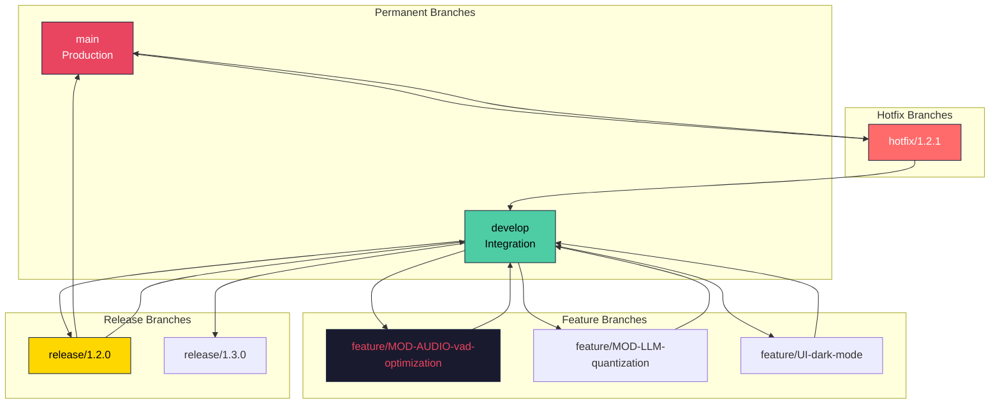
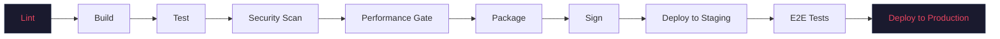

# VOXY — Developer Workflow

| Field | Value |
|-------|-------|
| **Version** | 1.0.0 |
| **Status** | Production-Ready |
| **Last Updated** | 2026-07-17 |
| **Author** | VOXY Engineering Team |
| **Classification** | Internal — Process Foundation |

---

## Purpose

This document defines the complete developer workflow for the VOXY project, including Git branching strategy, commit conventions, pull request procedures, CI/CD pipeline, code review requirements, and release management.

---

## Scope

Covers:
- Git branching model
- Commit message conventions
- Pull request workflow
- Code review process
- CI/CD pipeline stages
- Release management
- Hotfix procedures
- Environment management

Does not cover:
- Coding standards (see [04_CODING_STANDARDS.md](04_CODING_STANDARDS.md))
- Engineering rules (see [05_ENGINEERING_RULES.md](05_ENGINEERING_RULES.md))
- Build order (see [02_BUILD_ORDER.md](02_BUILD_ORDER.md))

---

## Audience

- All software engineers
- Tech Leads and Engineering Managers
- DevOps Engineers
- Release Managers
- AI Coding Agents

---

## Git Branching Model

VOXY uses a modified Git Flow model optimized for continuous delivery.



### Branch Types

| Branch | Prefix | Origin | Merge Target | Lifetime |
|--------|--------|--------|------------|----------|
| **main** | — | — | — | Permanent |
| **develop** | — | — | — | Permanent |
| **Feature** | `feature/` | `develop` | `develop` | Days to weeks |
| **Release** | `release/` | `develop` | `main` + `develop` | Days |
| **Hotfix** | `hotfix/` | `main` | `main` + `develop` | Hours to days |
| **Experiment** | `experiment/` | Any | None (may become feature) | Variable |

### Branch Naming Conventions

```
feature/MOD-{MODULE_ID}-{brief-description}
feature/MOD-AUDIO-wasapi-event-driven
feature/MOD-LLM-gptq-quantization
feature/UI-command-palette-redesign

release/{major}.{minor}.{patch}
release/1.2.0
release/1.3.0-beta.1

hotfix/{major}.{minor}.{patch}
hotfix/1.2.1
hotfix/1.2.2
```

---

## Commit Message Convention

VOXY follows the Conventional Commits specification with VOXY-specific scopes.

### Format

```
<type>(<scope>): <subject>

<body>

<footer>
```

### Types

| Type | Description | Example |
|------|-------------|---------|
| `feat` | New feature | `feat(MOD-AUDIO): add ASIO backend support` |
| `fix` | Bug fix | `fix(MOD-ASR): resolve race condition in streaming` |
| `perf` | Performance improvement | `perf(MOD-LLM): reduce memory allocation in inference` |
| `refactor` | Code restructuring | `refactor(MOD-EVENT): simplify channel routing` |
| `docs` | Documentation only | `docs: update API reference for MOD-WINAPI` |
| `test` | Test additions/changes | `test(MOD-AUDIO): add VAD accuracy benchmarks` |
| `chore` | Maintenance tasks | `chore: update dependencies to latest patch versions` |
| `build` | Build system changes | `build: add cargo-fuzz to CI pipeline` |
| `ci` | CI/CD changes | `ci: add Windows 10 runner to matrix` |
| `security` | Security fix | `security(MOD-SEC): fix timing attack in key derivation` |

### Scopes

| Scope | Module(s) |
|-------|-----------|
| `MOD-AUDIO` | Audio Pipeline |
| `MOD-WAKE` | Wake Word Engine |
| `MOD-ASR` | Speech Recognition |
| `MOD-NLU` | Natural Language Understanding |
| `MOD-LLM` | Local LLM Engine |
| `MOD-TTS` | Text-to-Speech |
| `MOD-ACTION` | Action Engine |
| `MOD-WINAPI` | Windows API Bridge |
| `MOD-UIAUTO` | UI Automation |
| `MOD-APPCTL` | Application Controller |
| `MOD-FILE` | File System Agent |
| `MOD-PROC` | Process Manager |
| `MOD-CONFIG` | Configuration Store |
| `MOD-EVENT` | Event Bus |
| `MOD-TELEM` | Telemetry & Logging |
| `MOD-UPDATE` | Update Service |
| `MOD-SEC` | Security Vault |
| `MOD-UI` | User Interface |
| `MOD-KB` | Knowledge Base |
| `MOD-PLUG` | Plugin System |
| `workspace` | Cross-module changes |
| `build-docs` | Documentation |
| `ci` | CI/CD configuration |

### Examples

```
feat(MOD-AUDIO): implement WASAPI event-driven capture mode

Add support for event-driven audio capture using WASAPI
AUDCLNT_STREAMFLAGS_EVENTCALLBACK. This reduces capture latency
from ~20ms to ~5ms on compatible hardware.

Refs: PERF-005
BREAKING CHANGE: AudioCaptureConfig now requires event_handle field
```

```
fix(MOD-LLM): prevent OOM on large context windows

Implement sliding window attention with KV cache eviction.
Previously, context windows >8K tokens caused unbounded memory
growth leading to process termination.

Closes: #452
```

```
security(MOD-SEC): rotate encryption keys on update

Implement automatic key rotation when application updates.
Old keys are preserved for 30 days to allow rollback, then
securely erased using CryptDestroyKey + SecureZeroMemory.

Refs: SEC-003, SEC-010
```

---

## Pull Request Workflow

### PR Template

Every PR must use the provided template:

```markdown
## Summary
<!-- Brief description of changes -->

## Related Issues
<!-- Link to issues (e.g., Closes #123, Refs #456) -->

## Module(s) Affected
<!-- Check all that apply -->
- [ ] MOD-AUDIO
- [ ] MOD-ASR
- [ ] MOD-LLM
- [ ] ...

## Type of Change
- [ ] Feature
- [ ] Bug Fix
- [ ] Performance Improvement
- [ ] Refactor
- [ ] Documentation
- [ ] Test

## Checklist
- [ ] Code follows [04_CODING_STANDARDS.md](04_CODING_STANDARDS.md)
- [ ] Tests added/updated
- [ ] Benchmarks run (if performance-related)
- [ ] `cargo clippy -- -D warnings` passes
- [ ] `cargo test` passes
- [ ] `cargo audit` is clean
- [ ] Documentation updated
- [ ] ADR created (if architectural change)
- [ ] Security review (if SEC-* rule affected)
- [ ] Privacy review (if PRIV-* rule affected)
```

### PR Size Guidelines

| Metric | Target | Maximum |
|--------|--------|---------|
| Lines changed | <200 | <500 |
| Files changed | <5 | <10 |
| Commits | <5 | <10 |
| Review time | <30 min | <60 min |

**Exception:** Large refactoring PRs must be split or pre-approved by Tech Lead.

### Review Requirements

| PR Type | Required Reviewers | Minimum Approvals |
|---------|-------------------|-------------------|
| Feature | 2 domain experts + 1 cross-domain | 2 |
| Bug Fix | 1 domain expert + 1 any | 2 |
| Hotfix | 1 domain expert (post-merge review) | 1 (expedited) |
| Documentation | 1 technical writer + 1 engineer | 1 |
| Security | Security team + 2 domain experts | 2 |
| Performance | Performance team + 1 domain expert | 2 |
| ADR/RFC | Architecture Review Board | Board majority |

### Merge Strategy

- **Squash merge** for feature branches (single commit on develop)
- **Merge commit** for release branches (preserves history)
- **Rebase** for hotfix branches (linear history on main)

---

## CI/CD Pipeline

### Pipeline Stages



### Stage Details

#### Stage 1: Lint

```yaml
lint:
  runs-on: windows-latest
  steps:
    - uses: actions/checkout@v4
    - name: Rustfmt
      run: cargo fmt --check
    - name: Clippy
      run: cargo clippy --workspace -- -D warnings
    - name: Cargo Deny
      run: cargo deny check
    - name: Cargo Machete
      run: cargo machete
```

#### Stage 2: Build

```yaml
build:
  runs-on: windows-latest
  strategy:
    matrix:
      profile: [dev, release]
      target: [x86_64-pc-windows-msvc]
  steps:
    - uses: actions/checkout@v4
    - name: Build
      run: cargo build --workspace --profile ${{ matrix.profile }}
```

#### Stage 3: Test

```yaml
test:
  runs-on: windows-latest
  needs: build
  steps:
    - uses: actions/checkout@v4
    - name: Unit Tests
      run: cargo nextest run --workspace
    - name: Integration Tests
      run: cargo test --workspace --test integration
    - name: Coverage
      run: cargo tarpaulin --workspace --out xml
```

#### Stage 4: Security Scan

```yaml
security:
  runs-on: windows-latest
  needs: build
  steps:
    - uses: actions/checkout@v4
    - name: Cargo Audit
      run: cargo audit --deny warnings
    - name: Secret Scan
      uses: trufflesecurity/trufflehog@main
    - name: CodeQL Analysis
      uses: github/codeql-action/analyze@v3
```

#### Stage 5: Performance Gate

```yaml
performance:
  runs-on: [self-hosted, windows, gpu]
  needs: [build, test]
  steps:
    - uses: actions/checkout@v4
    - name: Build Release
      run: cargo build --release --workspace
    - name: Run Benchmarks
      run: cargo bench --workspace
    - name: Check Budgets
      run: python scripts/ci/check_latency_budgets.py
```

#### Stage 6-9: Package, Sign, Deploy, E2E

```yaml
package:
  runs-on: windows-latest
  needs: [security, performance]
  if: github.ref == 'refs/heads/main' || startsWith(github.ref, 'refs/heads/release/')
  steps:
    - name: Build MSIX
      run: scripts/build/build-msix.ps1
    - name: Sign Package
      run: scripts/build/sign-msix.ps1
    - name: Upload Artifact
      uses: actions/upload-artifact@v4

deploy-staging:
  needs: package
  environment: staging
  steps:
    - name: Deploy to Staging
      run: scripts/deploy/deploy-staging.ps1

e2e:
  needs: deploy-staging
  runs-on: [self-hosted, windows]
  steps:
    - name: Run E2E Tests
      run: scripts/test/e2e-tests.ps1

deploy-production:
  needs: e2e
  environment: production
  if: github.ref == 'refs/heads/main'
  steps:
    - name: Deploy to Production
      run: scripts/deploy/deploy-production.ps1
```

---

## Release Management

### Versioning

VOXY follows Semantic Versioning (SemVer 2.0.0):

```
MAJOR.MINOR.PATCH[-prerelease][+build]

1.2.3-beta.1+20260717
```

| Component | When to Increment |
|-----------|-----------------|
| **MAJOR** | Breaking API changes, incompatible model formats, OS requirement changes |
| **MINOR** | New features, new modules, non-breaking enhancements |
| **PATCH** | Bug fixes, security patches, performance improvements |
| **prerelease** | Alpha, beta, RC builds |
| **build** | CI build timestamp |

### Release Schedule

| Release Type | Frequency | Lead Time |
|-------------|-----------|-----------|
| **Major** | Every 6-12 months | 8 weeks |
| **Minor** | Every 4-6 weeks | 2 weeks |
| **Patch** | As needed | 1-2 days |
| **Hotfix** | Immediate | Same day |

### Release Checklist

See [40_RELEASE_CHECKLIST.md](40_RELEASE_CHECKLIST.md) for the complete release verification checklist.

### Hotfix Procedure

1. Create `hotfix/{version}` from `main`
2. Apply minimal fix with tests
3. Fast-track review (1 approver minimum)
4. Merge to `main` and `develop`
5. Tag release immediately
6. Deploy to production
7. Post-incident review within 48 hours

---

## Environment Management

### Environments

| Environment | Purpose | Data | Access |
|------------|---------|------|--------|
| **Local** | Individual development | Synthetic | Developer |
| **CI** | Automated testing | Synthetic | CI service |
| **Staging** | Pre-release validation | Anonymized production | Team |
| **Production** | Live users | Real user data | Restricted |

### Configuration

Each environment uses a separate configuration file:

```
config/
  local.toml
  ci.toml
  staging.toml
  production.toml
```

Environment selection:
```bash
# Development
set VOXY_ENV=local

# CI
set VOXY_ENV=ci

# Staging/Production
set VOXY_ENV=staging  # or production
```

---

## Engineering Notes

### Why Squash Merge for Features?

- Keeps `develop` history clean and readable
- Each commit on `develop` is a complete, reviewable change
- Simplifies `git bisect` for regression detection
- Reduces noise from fixup commits

### Why Separate Staging and Production?

- Staging validates MSIX installation and update mechanisms
- Production deployment requires E2E test pass
- Rollback capability is tested in staging before production

---

## References

- [Conventional Commits](https://www.conventionalcommits.org/)
- [Semantic Versioning](https://semver.org/)
- [GitHub Flow](https://docs.github.com/en/get-started/quickstart/github-flow)
- [Git Flow](https://nvie.com/posts/a-successful-git-branching-model/)

---

## Cross References

- See [02_BUILD_ORDER.md](02_BUILD_ORDER.md) for build sequence.
- See [04_CODING_STANDARDS.md](04_CODING_STANDARDS.md) for code conventions.
- See [05_ENGINEERING_RULES.md](05_ENGINEERING_RULES.md) for non-negotiable constraints.
- See [34_REPOSITORY_RULES.md](34_REPOSITORY_RULES.md) for repository governance.
- See [40_RELEASE_CHECKLIST.md](40_RELEASE_CHECKLIST.md) for release verification.

---

## Best Practices

1. **Commit early, commit often** on feature branches.
2. **Keep PRs small and focused** — one concern per PR.
3. **Write PR descriptions** as if explaining to your future self.
4. **Review within 24 hours** — blockers should be addressed immediately.
5. **Never force-push to shared branches** (main, develop, release).

---

## Common Mistakes

| Mistake | Consequence | Prevention |
|---------|-------------|------------|
| Large PRs | Long review cycles, missed issues | Split into smaller PRs |
| Vague commit messages | Unreadable history | Follow Conventional Commits |
| Skipping CI on draft PRs | Late discovery of issues | Run CI on all PRs |
| Direct push to main | Broken production | Branch protection rules |
| Forgetting to update CHANGELOG | Incomplete release notes | PR checklist |

---

## Review Checklist

- [ ] Branching model is understood by all team members.
- [ ] Commit message convention is followed consistently.
- [ ] PR template is used for every pull request.
- [ ] Review requirements are enforced by branch protection.
- [ ] CI pipeline runs successfully on all PRs.
- [ ] Release process is documented and tested.
- [ ] Hotfix procedure is practiced in drills.

---

*End of 06_DEVELOPER_WORKFLOW.md*
