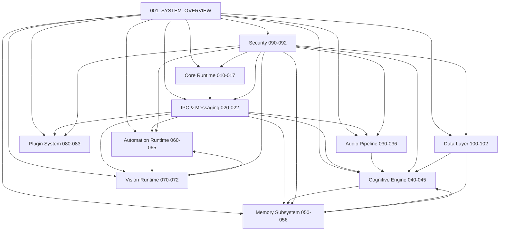

# VOXY Specification Index

## Repository Structure

```text
/specifications/
├── 000_SPECIFICATION_INDEX.md          (This file)
├── 001_SYSTEM_OVERVIEW.md              (System architecture and design principles)
│
├── Core Runtime (010-017)
│   ├── 010_KERNEL_SPEC.md              (Kernel subsystem — process lifecycle, threading, resource allocation)
│   ├── 011_RUNTIME_MANAGER_SPEC.md     (Runtime orchestration and service lifecycle)
│   ├── 012_EVENT_BUS_SPEC.md           (Inter-subsystem event distribution)
│   ├── 013_SERVICE_REGISTRY_SPEC.md    (Service discovery and registration)
│   ├── 014_CONFIGURATION_SPEC.md       (Configuration management and hot-reload)
│   ├── 015_LOGGING_SPEC.md             (Structured logging subsystem)
│   ├── 016_METRICS_SPEC.md             (Metrics collection and export)
│   └── 017_HEALTH_MONITOR_SPEC.md      (Health checking and failure detection)
│
├── IPC & Messaging (020-022)
│   ├── 020_IPC_PROTOCOL_SPEC.md        (Inter-process communication protocol)
│   ├── 021_MESSAGE_SCHEMA_SPEC.md      (Message envelope and schema definitions)
│   └── 022_COMMAND_SCHEMA_SPEC.md      (Command envelope and schema definitions)
│
├── Audio Pipeline (030-036)
│   ├── 030_AUDIO_PIPELINE_SPEC.md      (Audio pipeline orchestration)
│   ├── 031_AUDIO_CAPTURE_SPEC.md       (WASAPI-based audio capture)
│   ├── 032_WAKE_WORD_SPEC.md           (Wake word detection engine)
│   ├── 033_VAD_SPEC.md                 (Voice Activity Detection)
│   ├── 034_STT_SPEC.md                 (Speech-to-Text engine)
│   ├── 035_TTS_SPEC.md                 (Text-to-Speech engine)
│   └── 036_BARGE_IN_SPEC.md            (Barge-in and interruption handling)
│
├── Cognitive Engine (040-045)
│   ├── 040_CONTEXT_ASSEMBLY_SPEC.md    (Context window assembly and management)
│   ├── 041_MODEL_ROUTER_SPEC.md        (Model routing and selection)
│   ├── 042_PLANNER_SPEC.md             (Task planning and decomposition)
│   ├── 043_EXECUTOR_SPEC.md            (Plan execution engine)
│   ├── 044_REFLECTION_SPEC.md          (Self-reflection and quality assurance)
│   └── 045_TOOL_CALLING_SPEC.md        (Tool calling and function dispatch)
│
├── Memory Subsystem (050-056)
│   ├── 050_MEMORY_RUNTIME_SPEC.md      (Memory subsystem runtime)
│   ├── 051_WORKING_MEMORY_SPEC.md      (Short-term working memory)
│   ├── 052_EPISODIC_MEMORY_SPEC.md     (Event-based episodic memory)
│   ├── 053_SEMANTIC_MEMORY_SPEC.md     (Knowledge-based semantic memory)
│   ├── 054_PROCEDURAL_MEMORY_SPEC.md   (Skill-based procedural memory)
│   ├── 055_MEMORY_CONSOLIDATION_SPEC.md (Memory consolidation and sleep cycles)
│   └── 056_MEMORY_RETRIEVAL_SPEC.md    (Memory retrieval and ranking)
│
├── Automation Runtime (060-065)
│   ├── 060_AUTOMATION_RUNTIME_SPEC.md  (Automation subsystem runtime)
│   ├── 061_GROUNDING_ENGINE_SPEC.md    (UI grounding and element resolution)
│   ├── 062_UI_AUTOMATION_SPEC.md       (Windows UI Automation integration)
│   ├── 063_ACTION_EXECUTOR_SPEC.md     (UI action execution)
│   ├── 064_SCREEN_CAPTURE_SPEC.md      (Windows Graphics Capture integration)
│   └── 065_OCR_SPEC.md                 (Optical Character Recognition)
│
├── Vision Runtime (070-072)
│   ├── 070_VISION_RUNTIME_SPEC.md      (Vision subsystem runtime)
│   ├── 071_OBJECT_DETECTION_SPEC.md    (Object detection engine)
│   └── 072_UI_ANALYSIS_SPEC.md         (UI structure analysis and understanding)
│
├── Plugin System (080-083)
│   ├── 080_PLUGIN_RUNTIME_SPEC.md      (Plugin subsystem runtime)
│   ├── 081_PLUGIN_SDK_SPEC.md          (Plugin SDK and API surface)
│   ├── 082_PERMISSION_MODEL_SPEC.md    (Plugin permission model)
│   └── 083_SANDBOX_SPEC.md             (Plugin sandbox and isolation)
│
├── Security (090-092)
│   ├── 090_SECURITY_MODEL_SPEC.md      (Security architecture and threat model)
│   ├── 091_POLICY_ENGINE_SPEC.md       (Policy evaluation and enforcement)
│   └── 092_SECRET_STORAGE_SPEC.md      (Credential and secret storage)
│
├── Data Layer (100-102)
│   ├── 100_DATABASE_SCHEMA.md          (Relational database schema)
│   ├── 101_VECTOR_DATABASE_SPEC.md     (Vector database (sqlite-vec) specification)
│   └── 102_EMBEDDING_SPEC.md           (Embedding generation and management)
│
├── Configuration & Operations (110-112)
│   ├── 110_CONFIGURATION_SCHEMA.md     (Configuration file schema
│   ├── 111_ERROR_CODES_SPEC.md         (Error code taxonomy and definitions)
│   └── 112_TELEMETRY_SPEC.md           (Telemetry collection and export)
│
├── Performance (120-121)
│   ├── 120_PERFORMANCE_TARGETS.md      (Performance SLOs and targets)
│   └── 121_BENCHMARK_SPEC.md           (Benchmark methodology and suites)
│
├── Quality Assurance (130-131)
│   ├── 130_TESTING_SPEC.md             (Testing strategy and requirements)
│   └── 131_RELEASE_SPEC.md             (Release process and versioning)
│
└── README.md                           (Repository guide and conventions)
```

---

## Dependency Graph



---

## Specification Maturity Levels

| Level | Name | Description |
|-------|------|-------------|
| 0 | Draft | Initial concept, subject to significant change |
| 1 | Review | Under architectural review, interfaces stabilizing |
| 2 | Stable | Approved for implementation, interfaces frozen |
| 3 | Implemented | Implementation complete, specification verified |
| 4 | Production | Deployed in production, battle-tested |

---

## Cross-Reference Matrix

| Spec | Kernel | Runtime | EventBus | Registry | Config | Logging | Metrics | Health | IPC | Messages | Commands | Audio | Capture | Wake | VAD | STT | TTS | Barge | Context | Router | Planner | Executor | Reflection | Tools | Memory | Working | Episodic | Semantic | Procedural | Consolidation | Retrieval | Automation | Grounding | UI Auto | Actions | Screen | OCR | Vision | Object | UI Analysis | Plugin | SDK | Permissions | Sandbox | Security | Policy | Secrets | DB | Vector | Embedding | ConfigSchema | Errors | Telemetry | Perf | Benchmark | Testing | Release |
|------|--------|---------|----------|----------|--------|---------|---------|--------|-----|----------|----------|-------|---------|------|-----|-----|-----|-------|---------|--------|---------|----------|------------|-------|--------|---------|----------|----------|------------|---------------|-----------|----------|-----------|---------|---------|--------|-----|--------|--------|-------------|--------|-----|-------------|---------|----------|--------|---------|----|--------|-----------|--------------|--------|-----------|------|-----------|---------|---------|
| 010  |   ●    |    ●    |    ●     |    ●     |   ●    |    ●    |    ●    |   ●    |  ●  |    ●     |    ●     |   ●   |    ●    |  ●   |  ●  |  ●  |  ●  |   ●   |    ●    |   ●    |    ●    |    ●     |     ●      |   ●   |   ●    |    ●    |    ●     |    ●     |     ●      |      ●        |    ●      |    ●     |     ●     |    ●    |    ●    |   ●    |  ●  |   ●    |   ●    |      ●      |   ●    |  ●  |      ●      |    ●    |    ●     |   ●    |    ●    | ●  |   ●    |     ●     |      ●       |   ●    |     ●     |  ●   |     ●     |   ●     |    ●    |
| 011  |   ●    |    ●    |    ●     |    ●     |   ●    |    ●    |    ●    |   ●    |  ●  |    ●     |    ●     |   ●   |    ●    |  ●   |  ●  |  ●  |  ●  |   ●   |    ●    |   ●    |    ●    |    ●     |     ●      |   ●   |   ●    |    ●    |    ●     |    ●     |     ●      |      ●        |    ●      |    ●     |     ●     |    ●    |    ●    |   ●    |  ●  |   ●    |   ●    |      ●      |   ●    |  ●  |      ●      |    ●    |    ●     |   ●    |    ●    | ●  |   ●    |     ●     |      ●       |   ●    |     ●     |  ●   |     ●     |   ●     |    ●    |
| ...  |  ...   |   ...   |   ...    |   ...    |  ...   |   ...   |   ...   |  ...   | ... |   ...    |   ...    |  ...  |   ...   | ...  | ... | ... | ... |  ...  |   ...   |  ...   |   ...   |   ...    |    ...     |  ...  |  ...   |   ...   |   ...    |   ...    |    ...     |     ...       |   ...     |   ...    |    ...    |   ...   |   ...   |  ...   | ... |  ...   |  ...   |     ...     |  ...   | ... |     ...     |   ...   |   ...    |  ...   |   ...   | ...|  ...   |    ...    |     ...      |  ...   |    ...    | ...  |    ...    |  ...    |   ...   |

> Note: Full cross-reference matrix available in each specification's "Cross References" section.

---

## Document Conventions

- **MUST** — Absolute requirement
- **SHOULD** — Strong recommendation, may have valid exceptions
- **MAY** — Optional, implementation discretion
- **MUST NOT** — Absolute prohibition

---

## Version History

| Version | Date | Author | Changes |
|---------|------|--------|---------|
| 0.1.0 | 2026-07-17 | VOXY Architecture Team | Initial specification repository creation |

---

*This index is automatically generated. Last updated: 2026-07-17*
